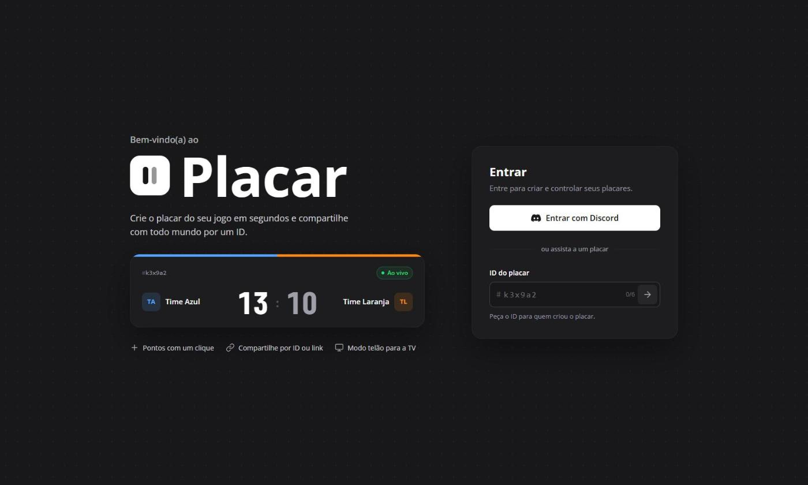
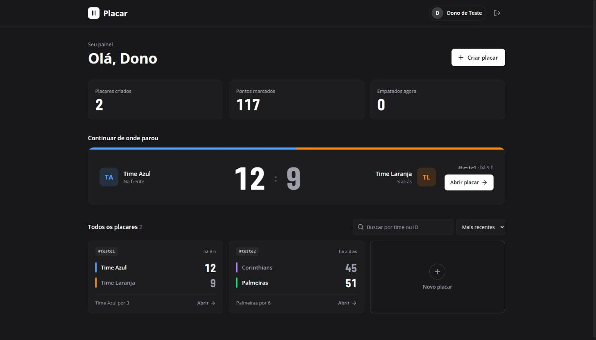
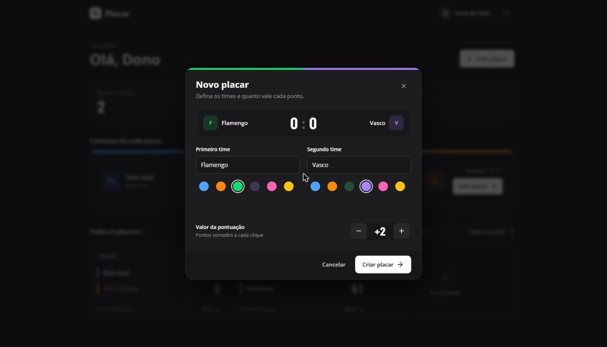
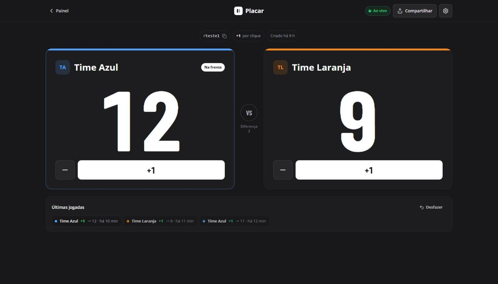
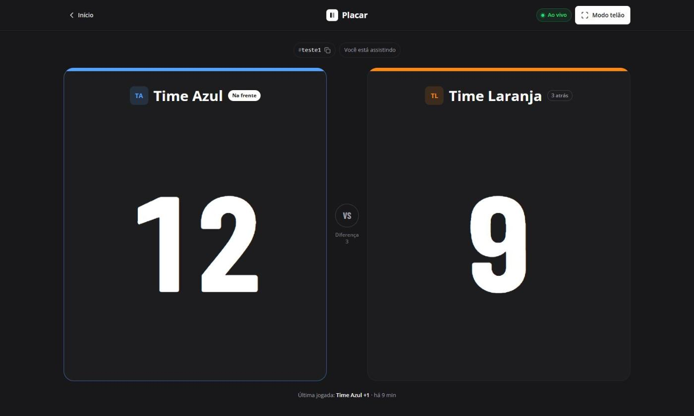
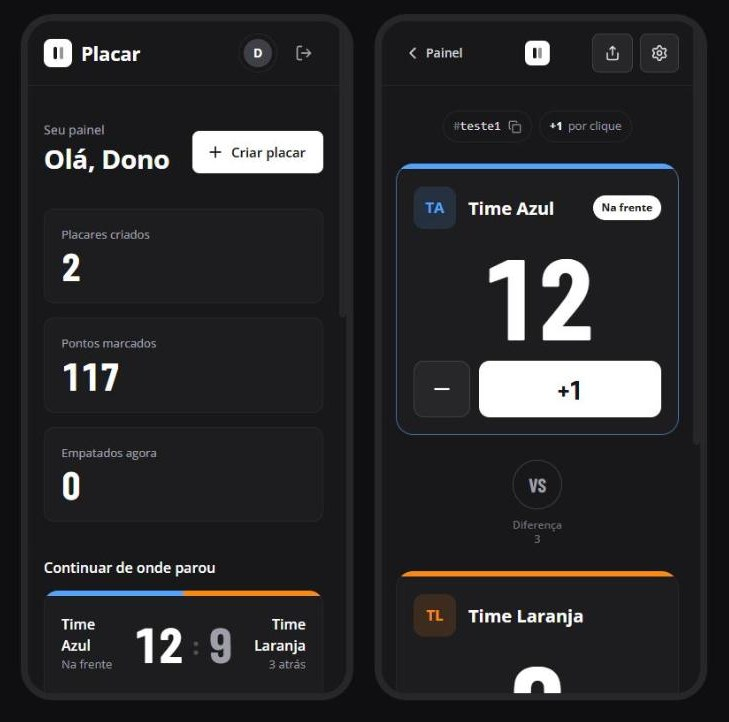

# Placar

O Placar é um app para marcar e compartilhar, em tempo real, a pontuação de qualquer disputa: futebol, jogo de cartas, jogo de tabuleiro, gincana… Quem cria o placar controla os pontos; quem tem o ID ou o link acompanha ao vivo, inclusive numa TV pelo modo telão.



## Funcionalidades ✨

- **Login com Discord** para criar e controlar seus placares.
- **Painel** com resumo, o último placar em destaque, busca e ordenação.
- **Placares personalizados**: nome e cor de cada time e quanto vale cada ponto.
- **Pontuação ao vivo**: quem está assistindo vê cada ponto na hora (Supabase Realtime).
- **Últimas jogadas** com **Desfazer**.
- **Compartilhamento** por ID de 6 caracteres ou por link.
- **Modo telão** para exibir o placar numa TV ou projetor.
- **Configurações** do placar: nomes, pontos por clique, tamanho dos números, reiniciar e apagar.
- Funciona no celular a partir de 360px.

## Prints 📸

| Painel | Novo placar |
|---|---|
|  |  |

| Placar (dono) | Placar (quem assiste) |
|---|---|
|  |  |

<p align="center">
  
</p>

## Tecnologias 🔧

- [Nuxt 4](https://nuxt.com/) + Vue 3 + TypeScript
- [Nuxt UI 4](https://ui.nuxt.com/) + Tailwind CSS 4 (só tema escuro)
- [Supabase](https://supabase.com/): Postgres, Auth (Discord) e Realtime
- [Vitest](https://vitest.dev/) + `@nuxt/test-utils` e [pgTAP](https://pgtap.org/) para os testes do banco
- [Bun](https://bun.sh/) como gerenciador de pacotes

## Roadmap 🗺️

- [ ] Modal de usuário: ver o perfil e as preferências da conta
- [ ] Cor dupla para os times (duas cores por time, como uniformes listrados)
- [ ] Mais opções de cor para os times, como preto e vermelho
- [ ] Editar as cores dos times depois de criar o placar
- [ ] Layout compacto no celular, com os dois times lado a lado para pontuar sem rolar a tela
- [ ] Modo telão também para o dono do placar
- [ ] Publicar em produção (novo projeto no Supabase e deploy)

## Como rodar o projeto 🚀

Requer o [Docker](https://www.docker.com/) rodando. O Supabase roda localmente via [Supabase CLI](https://supabase.com/docs/guides/local-development).

1. Clone o projeto.
2. Instale as dependências com `bun install`.
3. Suba o Supabase local com `bun run db:start`. As migrations em `supabase/migrations` criam as tabelas, as políticas de acesso e as funções do banco, e o `supabase/seed.sql` cria dados de exemplo.
4. Crie o `.env` a partir do `.env.example` e preencha `SUPABASE_KEY` com a `PUBLISHABLE_KEY` mostrada pelo `bun run db:status`.
5. Rode o projeto com `bun run dev` e abra http://localhost:3000.

### Login com Discord

1. Crie um app no [Discord Developer Portal](https://discord.com/developers/applications) e adicione o redirect `http://127.0.0.1:54321/auth/v1/callback`.
2. Crie o `supabase/.env` a partir do `supabase/.env.example` com o client id e o secret do app.
3. Reinicie o Supabase com `bun run db:stop` e `bun run db:start`.

> Sem configurar o Discord, dá para testar com os usuários de exemplo do seed (`dono@placar.test`, `outro@placar.test` e `vazio@placar.test`). A senha está no comentário do topo de `supabase/seed.sql`.

### Comandos do banco

| Comando | O que faz |
|---|---|
| `bun run db:start` / `bun run db:stop` | Sobe e para o Supabase local |
| `bun run db:status` | Mostra URLs e chaves |
| `bun run db:reset` | Recria o banco e reaplica as migrations e o seed |
| `bun run db:test` | Roda os testes do banco (pgTAP, em `supabase/tests/`) |
| `bun run database` | Regenera `app/types/database.types.ts` a partir do banco local |

O Supabase Studio fica em http://127.0.0.1:54323.

## Testes 🧪

Os testes do app usam Vitest com o ambiente do Nuxt (`@nuxt/test-utils`):

- `bun run test`: modo watch
- `bun run test:run`: roda uma vez
- `bun run test:coverage`: gera o relatório em `coverage/index.html`

> Use `bun run test`, e não `bun test`: este último chama o runner do Bun em vez do Vitest.

As regras do banco (travas, permissões e funções de pontuar, desfazer e reiniciar) são testadas com `bun run db:test`.

## Estrutura 📁

```
app/
  pages/          login (index), painel e placar (id/[id])
  components/     telas e peças reutilizáveis (modais, painéis de time, logomarca…)
  composables/    realtime do placar
  services/       acesso ao Supabase
  utils/          funções puras (resumo do jogo, tempo relativo, cores, ID)
supabase/
  migrations/     tabelas, políticas de acesso, funções e realtime
  tests/          testes do banco (pgTAP)
  seed.sql        dados de exemplo para o banco local
docs/             relatório do projeto, handoff do redesign e prints
```

## Contribuição 🤝

Toda contribuição é bem-vinda, desde melhorias de design a novas funcionalidades. Sinta-se à vontade para abrir uma issue ou um pull request.

## Licença 📝

Esse projeto está sob a licença MIT. Veja o arquivo [LICENSE](./LICENSE.md) para mais detalhes.
